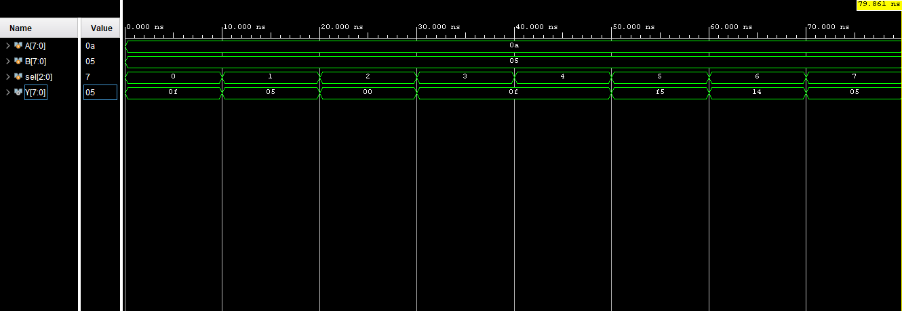

# 8-bit ALU using Verilog

This project implements an 8-bit Arithmetic Logic Unit (ALU) using Verilog HDL and simulates it using Xilinx Vivado.

The ALU performs arithmetic, logical, and shift operations based on the select input (`sel`).

---

# Features

The ALU supports the following operations:

| Select Line (`sel`) | Operation |
|---------------------|-----------|
| 000 | Addition |
| 001 | Subtraction |
| 010 | AND |
| 011 | OR |
| 100 | XOR |
| 101 | NOT |
| 110 | Left Shift |
| 111 | Right Shift |

---

# Project Files

| File | Description |
|------|-------------|
| `alu.v` | Main ALU design |
| `alu_tb.v` | Testbench for simulation |
| `waveform.png` | Output waveform from simulation |

---

# ALU Design

The ALU takes:
- Two 8-bit inputs:
  - `A`
  - `B`
- One 3-bit select line:
  - `sel`

Based on the value of `sel`, the ALU performs different operations and stores the result in output `Y`.

---

# Simulation Inputs

The following values were used in simulation:

```text
A = 10
B = 5
```

In hexadecimal:
```text
A = 0A
B = 05
```

---

# Simulation Waveform



---

# Output Explanation

## 1. Addition (`sel = 000`)

Operation:
```text
10 + 5 = 15
```

Output:
```text
Y = 0F
```

---

## 2. Subtraction (`sel = 001`)

Operation:
```text
10 - 5 = 5
```

Output:
```text
Y = 05
```

---

## 3. AND Operation (`sel = 010`)

Binary values:

```text
10 = 1010
 5 = 0101
--------------
AND = 0000
```

Output:
```text
Y = 00
```

---

## 4. OR Operation (`sel = 011`)

Binary values:

```text
1010
0101
-----
1111
```

Output:
```text
Y = 0F
```

---

## 5. XOR Operation (`sel = 100`)

Binary values:

```text
1010
0101
-----
1111
```

Output:
```text
Y = 0F
```

---

## 6. NOT Operation (`sel = 101`)

Binary value of A:

```text
00001010
```

After NOT operation:

```text
11110101
```

Output:
```text
Y = F5
```

---

## 7. Left Shift (`sel = 110`)

Operation:
```text
10 << 1 = 20
```

Binary:

```text
00001010 → 00010100
```

Output:
```text
Y = 14
```

---

## 8. Right Shift (`sel = 111`)

Operation:
```text
10 >> 1 = 5
```

Binary:

```text
00001010 → 00000101
```

Output:
```text
Y = 05
```

---

# Conclusion

The simulation results confirm that the ALU successfully performs:
- Arithmetic operations
- Logical operations
- Bitwise operations
- Shift operations

The waveform output verifies the correct functioning of the ALU for all select line values.
